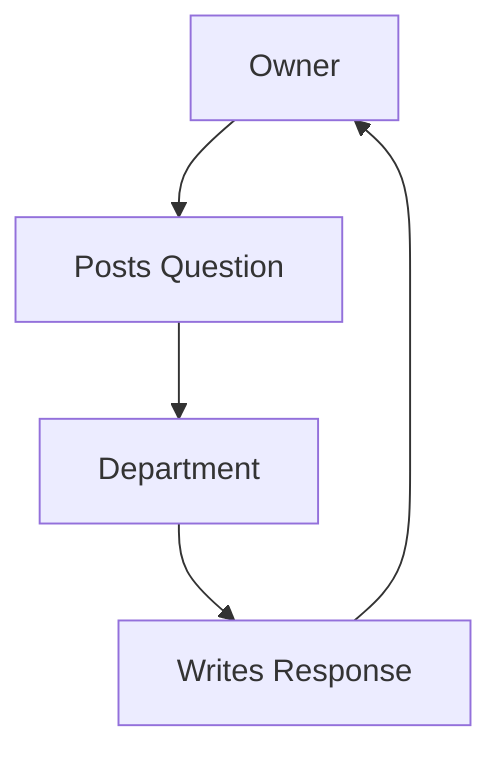

# 🏫 SchoolSync — School Management SaaS (Frontend Demo)

A **pure HTML SaaS prototype** designed to demonstrate how a school owner can monitor daily operations of all departments remotely without visiting the campus.

This project simulates a real SaaS MVP interface using only:

- Semantic HTML
- Static navigation
- Dummy data
- No CSS frameworks
- No JavaScript
- No backend

---

# 📁 Project Structure

```

school-saas-demo/
│
├── index.html
├── dashboard.html
├── departments.html
├── analytics.html
├── status.html
│
├── teaching.html
├── accounts.html
├── admin.html
├── transport.html
└── maintenance.html

````

---

# 🎯 Objective

To demonstrate a **Minimum Viable Product (MVP)** interface for a School Monitoring SaaS where:

- Department Heads submit daily updates
- Owner monitors remotely
- Submission deadlines are tracked
- Analytics provide insights
- Questions are handled asynchronously (no meetings required)

---

# 👥 Target Users

| User | Role |
|-----|------|
Owner | Viewer & decision maker |
Department Heads | Data reporters |

---

# 🔄 System Workflow

## Overall Flow Diagram

```mermaid
flowchart TD
A[Landing Page] --> B[Owner Login]
B --> C[Dashboard]
C --> D[Departments Page]
D --> E[Department Report]
C --> F[Submission Status]
C --> G[Analytics Dashboard]
````

---

## Department Reporting Flow

```mermaid
flowchart LR
A[Department Head] --> B[Fill Daily Questions]
B --> C[Submit Before 5PM]
C --> D[Owner Views Report]
```

---

## Async Communication Flow



---

# 📊 Features Implemented

## 1. Dashboard Monitoring

Owner can:

* View departments
* Check submission status
* Open analytics

---

## 2. Department Reports

Each department displays:

* 5 daily questions
* Structured answers
* Issue logs
* Attendance/operations summary

---

## 3. Submission Deadline Tracking

Status Page shows:

| Status          | Meaning    |
| --------------- | ---------- |
| ✅ Submitted     | On time    |
| ❌ Not Submitted | Missed     |
| ❌ Late          | After 5 PM |

---

## 4. Analytics Dashboard

Simulated insights include:

* On-time submission counts
* Departments with delays
* Repeated issues

> In a real SaaS system, these would be auto-generated using databases and analytics engines.

---

## 5. Async Question System (No Meetings)

Owner can ask questions on each department page.

Departments respond below.

This replaces physical meetings with documented communication.

---

# 🧠 Why This MVP Is Strong

This project demonstrates real SaaS product architecture thinking:

| SaaS Principle    | Implementation      |
| ----------------- | ------------------- |
| Remote monitoring | Dashboard system    |
| Data collection   | Department reports  |
| Accountability    | Submission tracking |
| Insights          | Analytics page      |
| Communication     | Q&A system          |

---

# 🚀 Real Production Version Would Add

If converted into a real SaaS platform, the following would be added:

* Authentication system
* Database storage
* Automated analytics engine
* Notification system
* Role-based access
* File uploads
* Real-time updates
* Mobile responsiveness

---

# 🏆 Evaluation Value

This project shows skills in:

* Product design thinking
* Information architecture
* UX flow planning
* Semantic HTML structure
* SaaS logic simulation
* MVP prototyping

Most frontend demos show UI.
This demo shows **system design thinking**.

---

# 📌 How to Run

Simply open:

```
index.html
```

in any browser.

No installation required.


---


